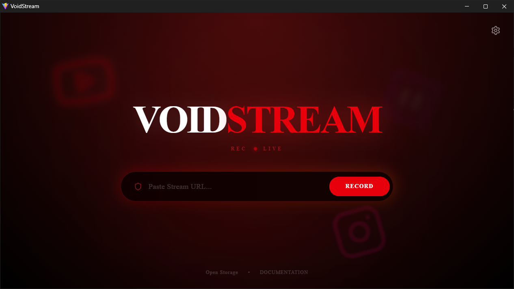
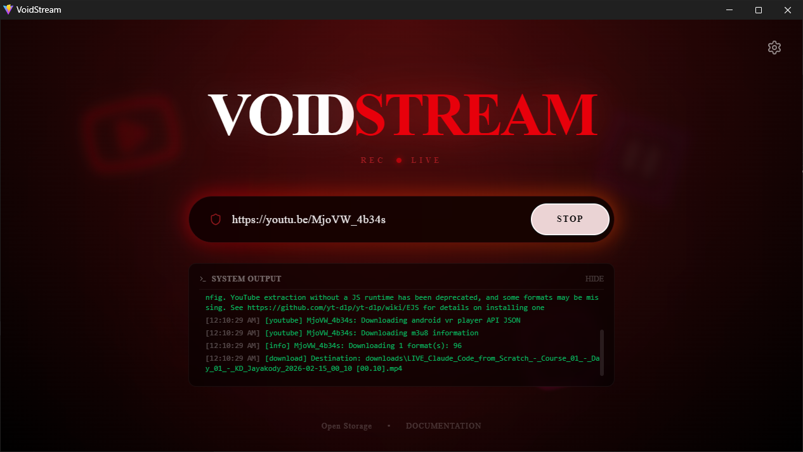
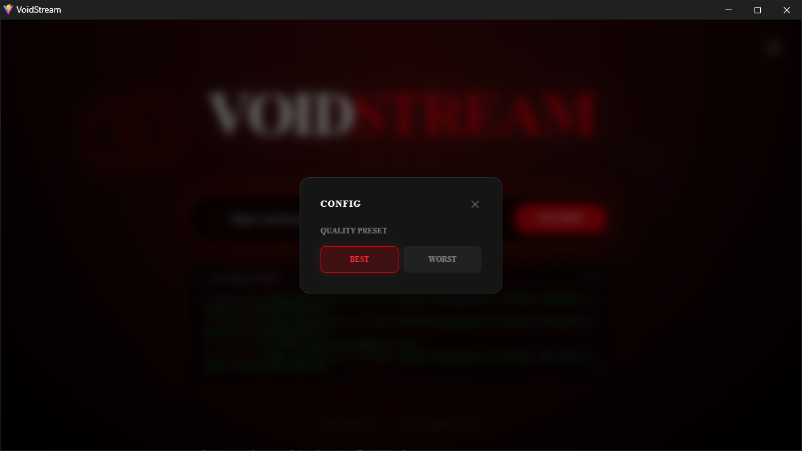

<div align="center">
  
  <h1>VOIDSTREAM</h1>
  
  <h3>🔴 The Ultimate Live Stream Archiver & Real-Time DVR</h3>

  <p>
    <strong>A futuristic, zero-latency GUI for capturing live broadcasts from YouTube, Twitch, TikTok, and m3u8 sources directly to disk.</strong>
  </p>

  <p>
    <a href="#gallery">Gallery</a> •
    <a href="#features">Features</a> •
    <a href="#installation">Installation</a> •
    <a href="#usage">Usage</a>
  </p>
  
  
  
  
  

</div>

---

## ⚡ Introduction

**VoidStream** (formerly known as *GravityDL*) is a high-performance **live stream recorder** designed for data archivists, content creators, and researchers who need a reliable way to save ephemeral content. 

Unlike browser extensions or screen recorders, VoidStream taps directly into the HLS/DASH manifest stream, pulling raw video data without re-encoding. This means **zero quality loss**, **minimal CPU usage**, and the ability to capture streams even on low-end hardware.

With its signature **"Darkroom Red"** aesthetic and **Cinema Mode** layout, it feels less like a downloader and more like a tactical capture console.

## 📸 Gallery

<div align="center">
  <h3>The Command Center</h3>
  
  
  <h3>Real-Time Capture Logs</h3>
  
  
  <h3>System Configuration</h3>
  
</div>

## 🚀 Key Features

*   **Universal Platform Support**: Instantly record from **YouTube Live** (DVR & non-DVR), **Twitch**, **TikTok Live**, **Instagram**, **Facebook**, **Vimeo**, and raw `.m3u8` playlists.
*   **Stealth Mode**: Backend processes spawn silently and are instantly killed upon exit—no "zombie" FFmpeg tasks slowing down your PC.
*   **Smart Filenaming**: Auto-detects stream titles and appends start timestamps (e.g., `Gaming Stream [22.45].mp4`) for easier sorting.
*   **Robust Error Handling**: If a stream drops, the internal engine attempts to reconnect or finalizes the file safely so you don't lose footage.
*   **Pro UI/UX**:
    *   **Cinema Ratio**: Fixed 16:9 window that snaps to 1280x720 for a consistent desktop footprint.
    *   **Focus Input**: Large, glow-effect input field for quick URL pasting.
    *   **Live Terminal**: Monitor the exact byte-stream status in real-time.

## 🛠️ Tech Stack

*   **Frontend**: React 18, Vite, Tailwind CSS v4, Framer Motion (Glassmorphism & Animations)
*   **Backend**: Python 3.11+, FastAPI, WebSockets (AsyncIO)
*   **Core**: `yt-dlp` (Media Extraction), `FFmpeg` (Stream Merging)
*   **Wrapper**: Microsoft Edge Application Mode (PWA-like Desktop Experience)

## 📥 Installation

### Prerequisites
1.  **Python 3.8+** (Add to PATH during install)
2.  **Node.js 18+** (For building the UI)
3.  **FFmpeg** (Must be reachable via system PATH)

### Setup Guide

1.  **Clone the Repository**
    ```bash
    git clone https://github.com/YOUR_USERNAME_HERE/voidstream-live-stream-downloader.git
    cd voidstream-live-stream-downloader
    ```

2.  **Initialize Backend**
    ```bash
    cd backend
    python -m venv venv
    # Windows:
    venv\Scripts\activate
    # Mac/Linux:
    # source venv/bin/activate
    pip install -r requirements.txt
    ```

3.  **Initialize Frontend**
    ```bash
    cd ../frontend
    npm install
    # Optional: Build for production
    # npm run build
    ```

4.  **Launch**
    Double-click `start_app.bat` on Windows.

## 🗺️ Roadmap

- [x] **v4.2**: "Recording Red" UI Overhaul & Stability Patches
- [x] **Core**: Zombie Process Killer Implementation
- [ ] **v5.0**: Multi-thread concurrent recording
- [ ] **Feature**: Scheduled recording (Time/Date trigger)
- [ ] **Feature**: Auto-convert to MP3 (Audio Only Mode)

## 📄 License
Distributed under the MIT License. See `LICENSE` for more information.

---

<p align="center">
  <sub>Built for the archivists. Keep the signal alive. 📡</sub>
</p>
